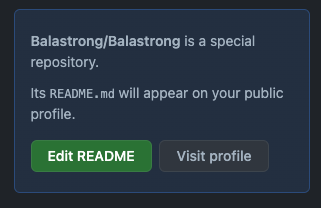

When navigating through GitHub you may land on awesome profiles with "live" content being updated automatically, what kind of sorcery is this?

Let's start from the beginning!


## Setup a personal profile

On top of the basic GitHub profile with pinned repos and the (very cool) contribution chart, you can fully customize the content in markdown basically by writing a README.md file, of your profile.

All you have to do is create a new repository with your username and put a README.md file in it.

In my case, my username is Balastrong so the repo will be Balastrong/Balastrong.



GitHub already notices that by adding this little badge in the home of your repo.

## Bring it to life with GitHub Actions!

I'm sure you know the existence of [GitHub Actions](https://github.com/features/actions). Well, they can be used to edit files in your repository, right?

Now, the file you're going to edit is README.md and it will fetch some content from the internet, before formatting and putting it into your file.

## Chess.com games!


Now that we have the combination profile + actions, we can make the magic!

All you need is to use this action: Chess.com Games & Stats [[Marketplace](https://github.com/marketplace/actions/chess-com-games-stats)], [[Repository](https://github.com/Balastrong/chess-stats-action)].

You can find the instruction there!
In short, you just need to two two basic steps:

### 1. Setup a placeholder in your README.md

You can control where the data will appear by putting this inside your file:

```html
<!--START_SECTION:chessStats-->

<!--END_SECTION:chessStats-->
```

### 2. Setup the action

GitHub helps you setting up a new action, but anyway it's just adding a new file in `.github/workflows` in your repository and that's it.

The content is as simple as:

```yaml
name: Chess Stats Action

on:
  schedule:
    - cron: "0 0 * * *" # Runs at 00:00 UTC every day
  workflow_dispatch:

jobs:
  update-readme:
    name: Update readme with your chess stats and games
    runs-on: ubuntu-latest
    steps:
      - uses: actions/checkout@v3
      - uses: Balastrong/chess-stats-action@master
        with:
          CHESS_USERNAME: <Your chess.com Username>
```

Just replace `<Your chess.com Username>` and you're good to go!

With the current `cron schedule` it will run by itself ad midnight UTC, but thanks to `workflow_dispatch` you can also run the action manually at any time.

You can see a live example at the bottom of my profile: https://github.com/Balastrong/

## Getting the games

Here some additional context on the APIs, you might be curious about it!

Chess.com has some APIs but not exactly a complete game list. An official source of info is their [Developer Community](https://www.chess.com/club/chess-com-developer-community).

For some reason, you can only get the games already grouped by year/month, in the format:

```
https://api.chess.com/pub/player/{username}/games/{YYYY}/{MM}
```

They call this "_archive_".

You can also get a list of available archives for a player:

```
https://api.chess.com/pub/player/{username}/games/archives
```

Since my goal was to get the last N games and I cannot know how many games an archive has, I decided to request the archives first, and then call them one by one until I get the desired amount of games (or I requested 5 archives, that's enough).

Aaand... it kind of works :)
