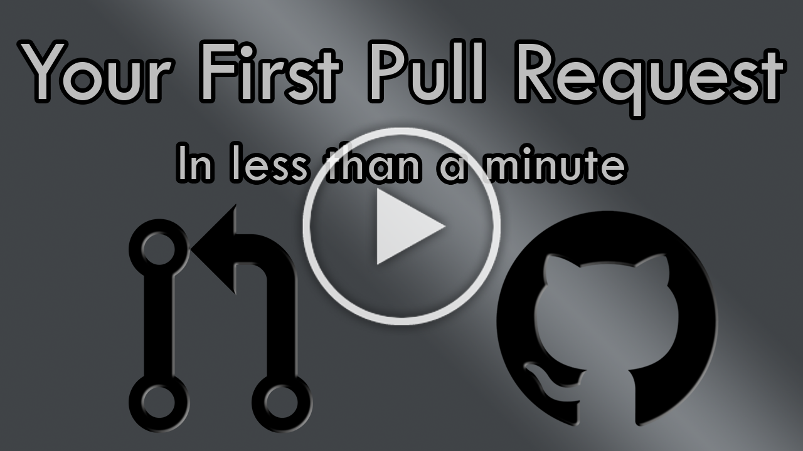

## Intro

Let's see the steps you need from zero to creating your first Pull Request.

If you're already following me, you know I'm an Open Source enthusiast.
_If you're not following me, that's bad but you can start today_ 😁

You might also know I like making [YouTube videos](https://www.youtube.com/channel/UC-KqnO3ez7vF-kyIQ_22rdA) and I'm having fun with #Shorts recently.

The most recent one is a YouTube Short (that is a video of less than 60 seconds) that attempts to show in a practical way how to open your first Pull Request on GitHub. You can watch it by clicking [here](https://youtube.com/shorts/0HKE5nDypUg).

It's mostly for beginners, so if you're already actively contributing you might already know everything. There isn't any secret recipe revealed here 😅

If you want to start today ([you should](https://youtu.be/uquIcISFtwg)), then you better watch the video!

## How to create your First Pull Request on GitHub in less than 60 seconds

Well, after this long intro, here's the juicy content.

#### 1. Setup

Nowadays the go-to platform is [GitHub](https://github.com/), in case you don't have an account yet you can create one real quick.

#### 2. Find your way (actually, a repo)

Find a repository you want to contribute at, I'm already writing the script for a video entirely about that.

#### 3. Get a job (I mean, an issue)

Scroll through the issues, you should find some with labels `Good First Issue` or `Help Wanted`, they’re usually the best to begin. In some big project, only issues with those lables are considered for PRs.

#### 4. Start working!

Let everyone know you’re gonna work on that issue by writing a comment.

#### 5. Fork🍴

You’ll now need a Fork of the repository, you can create one with the button on the top right corner of the repository.

#### 6. Work(s) on your machine

Clone your fork locally, do your changes in a new branch and push them.

#### 7. Stop. PR Time!

Back to the original repo, you will now see a button to create a Pull Request, click on it!

Fill in the additional details and it’s done, you can now wait for the maintainers to give you feedback on your work.

## Conclusions

Ok, this was just a drill. Now you know all the steps you will need to perform to open your first Pull Request.

Feel free to write a comment if you didn't understand something or if you want to add some advice. Thank you!
