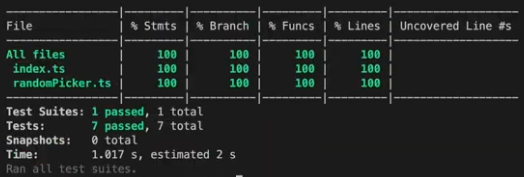

_You can find a [video version](https://youtu.be/jNBw9_qNgmo) of this article on my [YouTube Channel](https://www.youtube.com/channel/UC-KqnO3ez7vF-kyIQ_22rdA)._

## Intro

Today we're building together a weighted random generator. You may also know it as a random loot table generator, or gacha system.

In short, what it does is extract a random object considering its weight. An object with a higher weight is more likely to be picked up than an item with a smaller weight (or call it chance).

As a side quest, we're going to keep code coverage at 100% ✅



### Output

The final result is already available on [GitHub](https://github.com/Balastrong/wrand) (there are [open issues](https://github.com/Balastrong/wrand/issues) to pick up!).

You can also install it from [npm](https://www.npmjs.com/package/wrand) and [deno](https://deno.land/x/wrand).

If you're on node, you can install it with `npm i wrand` and you can use it like so:

```typescript
const picker = new RandomPicker(items);

const result = picker.pick();
const results = picker.pickMany(3);
```

## Development

As seen in the preview, we're going to build a generator (with a class) that takes an array of objects in the constructor and will spit out randomly picked items with two methods: `pick` and `pickMany`.

### Typing

As we're in Typescript, let's start by giving a type definition to our input.

https://gist.github.com/Balastrong/6784d2d12cf887c026a03bbaeec9011b

Our type will have two fields, one to keep the original items we passed in, and the other to store its weight (or chance, probability).
A heavier weight means more likely to be picked up.

### Core class

To add some more informative content, we'll build this up with a little bit of Test Driven Development (TDD).

We can create a new file, randomGenerator.ts with the skeleton of the final product.

https://gist.github.com/Balastrong/4eeb096cd9726efe81c38c0895494d40

Before writing the implementation, we have to write the tests! This approach helps write code that is more reliable and with fewer bugs as you focus on the business logic first, and only after that on the implementation.

In this case, I'm using Jest, so `npm i jest` to have it running.

In my tests, I want to make sure that:

1. The class is instantiated properly.
1. A random item is picked and comes from my list.
1. N random items are picked, exactly the amount I requested and all of them are in the list.
1. Works not only with strings but also with objects.

https://gist.github.com/Balastrong/f8cf757a5b8e39d9cca16a6cdc75a695

_Note: To improve the tests even more, there's an [open issue](https://github.com/Balastrong/wrand/issues/5) about passing a custom random generator. This could allow to set a generator with a specific seed (Math.random can't do that) and make the tests predictable, rather than entirely random._

Now that the tests are written, we can proceed with the implementation.

https://gist.github.com/Balastrong/95998c34d114aee61ca597af98a24398

If we run the test now, they're all green and 100% code coverage ✅

### Validation

Let's add some validation to our input. As usual, tests first!

This time we want to check that:

1. The list is not empty
1. There are no duplicates
1. There are no negative weights

https://gist.github.com/Balastrong/336a7aed5a951c30ad8832b001215769

Tests are looking good, we can implement the validation method.

https://gist.github.com/Balastrong/e0aef8b0889616c6bdcc3fe749e219ce

`npm run test` and it's all green and 100% again! ✅



### Standalone

With the current implementation, to pick one item only you need to explicitly create the `RandomGenerator` instance and call `pick` on it.

As we're building a library, it might be useful to also provide some standalone methods that do everything under the hood so that one can directly call `pick` or `pickMany` without seeing the logic behind it.

https://gist.github.com/Balastrong/14d684e75a560200cc5922ce66e82bcf

### Going further

The core implementation is done and the requested functionalities described at the beginning are already working.

As I mentioned, the library is Open Source and the code is available on [GitHub](https://github.com/Balastrong/wrand). I'm repeating it because this means it's open to contributions and for example, you're free to pick up some of the [open issues](https://github.com/Balastrong/wrand/issues).

In the meantime, the library has been extended with more utility methods (`getItems`, `getWeights`, `getTotalWeight`, `getCount`) and also an extra standalone method to `flatten` the items in case you have duplicates and you want to aggregate their weights.

Feel free to jump on GitHub and extend it, even more, I'm waiting for your Pull Requests! :)

[](https://youtu.be/jNBw9_qNgmo)
