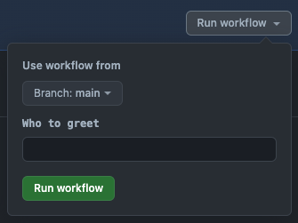
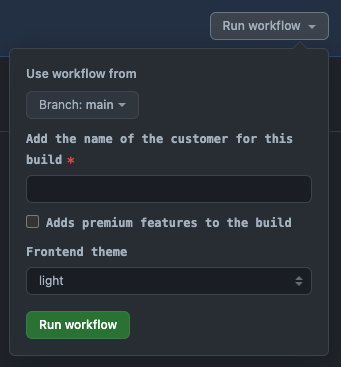

There's a plethora of triggers you can use to run a GitHub Action. You can run it on a schedule, on a push or a pull request, or even on a release.

Today we're going to talk about `workflow_dispatch`, a trigger that allows you to manually trigger a GitHub Action, without having to push or create a pull request. **Bonus: you can also pass custom parameters!**

## How to use workflow_dispatch

To use `workflow_dispatch`, you need to add it to the `on` section of your workflow file:

```yaml
name: Manual trigger

on:
  workflow_dispatch:
```

That's it! Now you can manually trigger your GitHub Action by going to the Actions tab of your repository and clicking on the "Run workflow" button:


## Live Demo

If you want to see it in action (pun intended!) you can watch the video below. Otherwise, if you prefer to read, you can jump to the next section.



## Passing inputs

You can also pass inputs to your workflow. To do so, you need to add an `inputs` section to your `workflow_dispatch` trigger. The only required field is the `description` which will also be rendered in the UI:

```yaml
name: Manual trigger

on:
  workflow_dispatch:
    inputs:
      name:
        description: "Who to greet"
        default: "World"
```

You can now pass an input to your workflow by clicking on the "Run workflow" button and filling the input field:



You can then access the input in your workflow file from the `github.event.inputs` object:

```yaml
name: Manual trigger

on:
  workflow_dispatch:
    inputs:
      name:
        description: "Who to greet"
        default: "World"

jobs:
    hello:
        runs-on: ubuntu-latest

        steps:
        - name: Hello Step
            run: echo "Hello ${{ github.event.inputs.name }}"
```

In this case, the variable we read is `name`, which is the name of the input we specified in the `workflow_dispatch` trigger.

## Input types

You can also specify the type of the input. There are many types, for example: `string`, `boolean` and `choice`, and `url`. If you don't specify a type, the default is `string`.

- `string`: will render a simple text input.
- `boolean`: is submitted through a checkbox.
- `choice`: renders a dropdown menu to force the selection of some specific values.

You can also specify if the field is `required` and add a default value.



## Lean more

`workflow_dispatch` is the keyword you need to run a GitHub Action on demand, without having to push or create a pull request.

If you want to learn more on GitHub Actions, let me reccomend you my YouTube Playlist with all the videos I made about GitHub Actions. [Click here](https://www.youtube.com/playlist?list=PLOQjd5dsGSxKC4K12-iLnla5E7rjJr_Ts).
