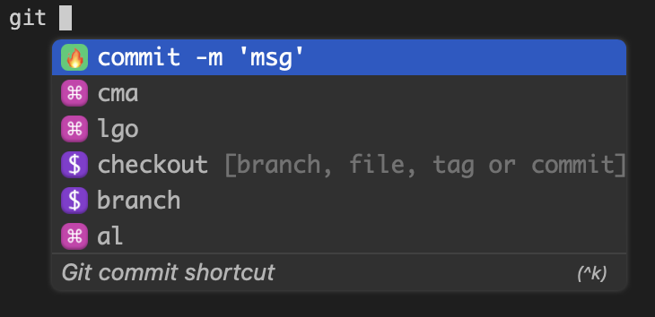

I get asked on every single video what is this autocomplete I’ve got on my terminal, and the answer is... _drum rolls..._ [fig](https://fig.io/)!

Actually, it's much more than a simple autocomplete, even if to be honest it's what I use 90% of the time.

If you want to see a showcase of some of the major features, as usual, I recorded a video and you can find it on YouTube!



Still here? If you're not a video guy, feel free to read the article instead!

### Autocomplete

Let’s give a closer look at autocomplete.

What you could expect from an autocomplete is to suggest you the next command while typing it. Or for example, getting the list of all the files in the current directory.

Fig does much much more! When you start typing a command (for example `git checkout`) you will see fig suggesting all the possible flags and options you can use, for example `--force` or `-b`.

Enough? Not yet! You can also see on the recommendations all the available branches you can pass as argument to the command!


I mean, it's cool on an image, but you should really have a look at the video to see it in action!

You will be surprised to notice that as soon as you start typing `git`, you will see in the autocomplete some weird commands, like `cma` or `lgo`. What are those? Well, they are the aliases I defined in my dotfiles, and fig is able to read them and suggest them to me!



### Artificial Intelligence

The coolest feature right after autocomplete is… well, the name is self explanatory… artificial intelligence. We’re in 2023, AI is everywhere, including our terminals.

With fig, you can start typing `fig ai` to get some help.

To begin with, let's start with a simple `fig ai -h` to get the help.

```bash
English -> Bash translation

Usage: fig ai [INPUT]...

Arguments:
  [INPUT]...

Options:
  -h, --help  Print help
```

It's all there on the first line, it translates English to Bash. Just write in plain english what you want to do and fig will translate it to a bash command for you!

Then you can either use it, edit it or ask the ai to generate a new command.

Again, I think it doesn't give it justice just written as a blog post, you should really really watch the video or even better try it yourself.

### Custom scripts

In a concept similar to alias, you can define some custom scripts and give them a name.

When you type `fig run` in your terminal, you will get a list of all the scripts you defined.

There's also a script store where you can find some scripts other people created and use them directly in your terminal.

### Plugins

Similar to the scripts and the script store, you can find plugins aaaand a plugin store.

With plugins you can even further enhance your terminal experience.

### Dotfiles

Fig helps you manage aliases, variables, paths and more, all in one place.

As you can see in the video I'm not really using this feature, but I think I should. It's one of those nice to have that you can easily live without, but once you discover them you start thinking why you haven't started using them earlier.

### Open Source

Did I already mention the autocomplete is Open Source? You can contribute on GitHub.

Plugins are open source too and you can add yours directly on the repo!

Actually, feel free to go on the [withfig](https://github.com/withfig/) page and have a look at all the repos, there's a lot to discover.

### Closing

And that’s it! It wasn’t a paid sponsorship but I genuinely enjoy using fig’s autocomplete every day and since you asked many times I though it was cool to make an entire piece of content about it.

Do you also use fig and its other features? Let me know in the comments!
