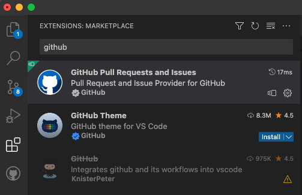
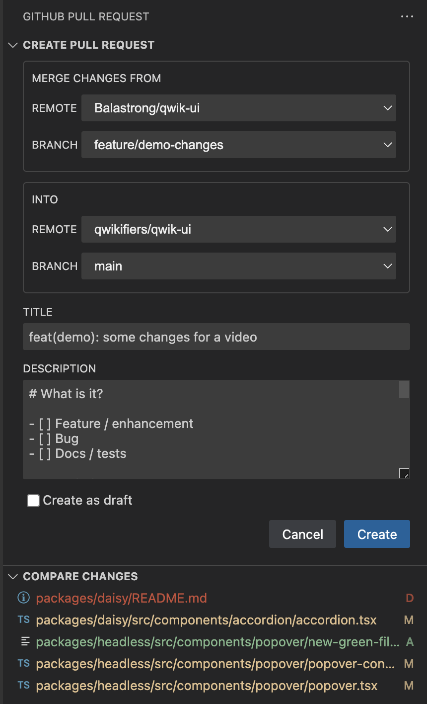
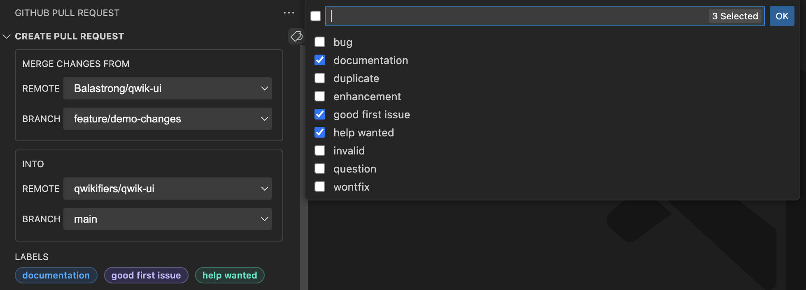

Did anyone say the word _Productivity_? We're all used to the GitHub User Interface so we usually navigate to GitHub, then search for our repository and then click the button to create a Pull Request.

But did you know that you can do all of this from Visual Studio Code? In this article, we'll see how to create a Pull Request from Visual Studio Code in literally two clicks.

This article will also be the first of a trilogy about the Github+VScode workflow, you better stay tuned to see what else you can do! ;)

---

If you're new to my articles, you know I usually match them with a YouTube video. Fun fact: while recording it I noticed the Visual Studio Code extension had a little bug, the perfect opportunity to contribute to the project and to use the extension to create a Pull Request fixing a bug of the extension itself. I'll tell you more in the video:



In any case, if you don't really like watching videos, I'll do my best to explain everything down here with some screenshots to make it easier to follow.

## Install the official GitHub Extension

The first thing you need to do is to install the official **GitHub Pull Requests and Issues** extension for Visual Studio Code. You can find it in the marketplace by searching for "GitHub" or by clicking [here](https://marketplace.visualstudio.com/items?itemName=GitHub.vscode-pull-request-github).

_Note_: make sure to not get confused, the extension called "GitHub" is and old one and deprecated. The new one is called "GitHub Pull Requests and Issues".

As soon as the extension is installed, you'll see a new icon in the Activity Bar on the left side of Visual Studio Code:

Opening it the first time will ask you to login to GitHub, just click on the button and a browser tab will open where you can login to your GitHub account.

## Create a Pull Request

Now that you're logged in, you can create a Pull Request from Visual Studio Code by clicking the icon on the top bar:

If you're already on a pushed branch, this is the panel that will open:

### Merge Changes From

The first panel you will see allows you to select the origin branch that is the one containing the changes you want to merge. By default, it will select the current branch you're on.

You can also select the remote in case you have more than one. In the most common open source situation you'll have your fork and the original repository. In this panel, you might want to select your fork.

### Into

Similar to the previous panel it allows you to select a remote and a branch. This time it's the destination. If you're working on your own project the remote will likely be the same as the one you selected in the previous panel, but if you're contributing to someone else's project you'll likely want to select the original repository.

Branch is usually `main` but make sure to read the project's contribution guidelines to see if there's a specific branch you should use.

### Title

You PR's title. By default it will use the message of the last commit, but you can change it to whatever you want.

### Description

You PR's description. If the project has a template in `.github/PULL_REQUEST_TEMPLATE.md`, you will see this box already filled with the template. Similar to the title, you're free to change it.

### Create as draft

The final option before the Create button is a checkbox that allows you to create the PR as a draft. This is useful if you want to create the PR but you're not ready to merge it yet.

### Create

Once you're happy with the options you selected, you can click the Create button and the PR will be created on GitHub!

### Compare changes

Waaaait a moment, before clicking the Create button, you can also open the Compare changes panel right below.

From this panel you can see all changes that will be included in the Pull Request in the diff format you're used to see on vscode, so green files are added, red are deleted and yellow are modified.

### Add labels

Aren't labels also supported? I can't see them in the screenshot... well, that's because the button only shows up if you hover the mouse over the top bar.

To be honest I'm not sure this is a feature or a bug, I might open an issue on the extension's repository to ask about it.

Anyway, if you click that button, the quick pick menu will open on vscode letting you select the labels you want to add to the PR from the list of labels available in the repository.

And as I [mention in the video](), this is exactly where I found the bug!

https://github.com/microsoft/vscode-pull-request-github/pull/4637

## Creating the Pull Request

Ok, at this point we've seen pretty much everything we needed, we created the Pull Request from the Create button and if you go on GitHub you can see it's there, ready to be reviewed.

Speaking of reviewing Pull Requests... wouldn't be cool if this was also possible from Visual Studio Code? Well, you're in luck, because that's exactly what we're going to see in the next article of this three articles series! Stay tuned!
