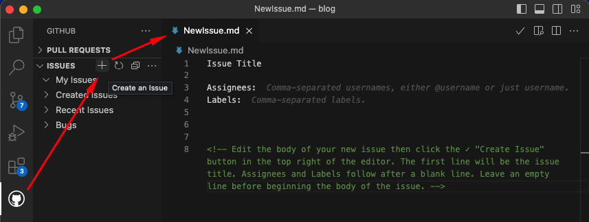
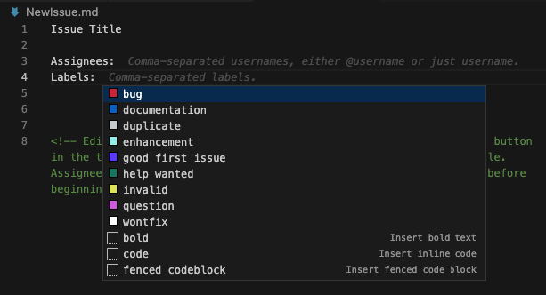

Stop! 🛑 You no longer need to open GitHub and search 🔎 for that issue you were assigned to. You can do it from Visual Studio Code! 📈

Two weeks ago we learned how to create a Pull Request on GitHub from Visual Studio Code and last week we saw how to review it. Today we'll see how to manage issues on GitHub from the editor.

This will mark the end of the series of three videos, showing you how to maximize your productivity when working with GitHub from Visual Studio Code, with the official extension: GitHub Pull Requests and Issues.



---

If you don't like learning through videos, don't worry! The article below covers all the topics discussed in the video in a friendly and approachable way. However, I highly recommend watching the video for an even more comprehensive understanding of the material.

---

## Install the official GitHub Extension

_(If you already installed the extension last week, you can skip this step!)_

The first thing you need to do is to install the official **GitHub Pull Requests and Issues** extension for Visual Studio Code. You can find it in the marketplace by searching for "GitHub" or by clicking [here](https://marketplace.visualstudio.com/items?itemName=GitHub.vscode-pull-request-github).


_Note_: make sure to not get confused, the extension called "GitHub" is an old one and deprecated. The new one is called "GitHub Pull Requests and Issues".

As soon as the extension is installed, you'll see a new icon in the Activity Bar on the left side of Visual Studio Code:


Opening it the first time will ask you to login to GitHub, just click on the button and a browser tab will open where you can login to your GitHub account.

## Create a new issue

The extension tab actually has two sections: **Pull Requests** and **Issues**. If you expand the **Issues** section, you'll see the + button to create a new issue.



By clicking on it, a new temporary file called `NewIssue.md` will be created in the editor. The content will be:

```markdown
Issue Title

Assignees:
Labels:

<!-- Edit the body of your new issue then click the ✓ "Create Issue" button in the top right of the editor. The first line will be the issue title. Assignees and Labels follow after a blank line. Leave an empty line before beginning the body of the issue. -->
```

From there, you can replace `Issue Title` with the title of your issue, add the assignees and labels, and write the description of the issue as per instructions in the file.

Assigning labels is made even easier as you get a list of all the labels in the repository, and you can select the ones you want to assign to the issue.



Once you're done, save the file and click on the ✓ button in the top right corner of the editor to create the issue.

A native vscode notification will inform you that the issue has been created successfully and it will also show up in the "Recent Issues" section of the extension tab.

## Work on an existing issue

If you want to work on an existing issue, first of all you can read its content by hovering the mouse on top of it. This will show you a preview of the issue and two buttons: `Start working on issue and checkout topic branch` and `Open Issue`.


Not so much to say about the latter, it will open the issue in the browser, but the first one is very interesting.

If you click on it, the extension will create a new branch for you, based on the issue number, and will checkout that branch. This is very useful if you want to work on multiple issues at the same time, as you can easily switch between them.

It will also assign the issue to you, so that other people know that you're working on it.

## Edit tabs

Similarly to the Pull Requests tab, the Issues tab has a few tabs at the top of the editor and they're fully customizable.

If you hover the mouse on them, you notice a pencil icon. Click on it! It will open your local vscode settings and you can notice this piece of configuration:

```json
"githubIssues.queries": [
  {
    "label": "My Issues",
    "query": "default"
  },
  {
    "label": "Created Issues",
    "query": "author:${user} state:open repo:${owner}/${repository} sort:created-desc"
  },
  {
    "label": "Recent Issues",
    "query": "state:open repo:${owner}/${repository} sort:updated-desc"
  }
]
```

If you want to add a new tab, just add a new object to the array, like this:

```json
{
  "label": "Bugs",
  "query": "label:bug state:open repo:${owner}/${repository} sort:created-desc"
}
```

You can add as many tabs as you want, and you can customize the label and the query. The query is a GitHub search query, so you can use all the filters you want. Make sure to always set `repo:${owner}/${repository}` in the filters list, as otherwise the query will be applied to all the repositories you have access to.

## What about X and Y?

Some features might be missing from the extension. There could also be some bugs (actually I [fixed two](https://github.com/microsoft/vscode-pull-request-github/pulls?q=is%3Apr+is%3Aclosed+author%3ABalastrong+label) while writing the articles of this series). So what?

Well, the extension is open source, so you can contribute to it! You can find the repository at [https://github.com/microsoft/vscode-pull-request-github](https://github.com/microsoft/vscode-pull-request-github).

In case you find a bug or you want to suggest a new feature, you can open an issue on the repository.

Not sure how to to that? You can learn here [how to fork a repository](https://youtu.be/VbfvQzCoiQc) and then here [how to create a Pull Request from Visual Studio Code](https://youtu.be/Ma67EbIHi64).

## Conclusion

To wrap up, in this three articles series we learned how to get the most out of the official [GitHub Pull Requests and Issues](https://marketplace.visualstudio.com/items?itemName=GitHub.vscode-pull-request-github) extension for Visual Studio Code.

I really hope you enjoyed it and that you learned something new. If you did, please consider sharing it with your friends and colleagues!

Also, let me know if you liked this kind of content split into multiple articles and videos, I had fun doing it and I'll be happy to do more if you like them!

---

## The video series

As mentioned at the beginning of the article, this is the third of a trilogy about the GitHub+VSCode workflow.

Each article will be accompanied by a video on YouTube, you can find them here:

1. [Create a Pull Request from Visual Studio Code](https://youtu.be/Ma67EbIHi64)
2. [Review a Pull Request from Visual Studio Code](https://youtu.be/DSl-L6B_Qb4)
3. [GitHub Issues on Visual Studio Code](https://youtu.be/-nfUgBLBTIo)
